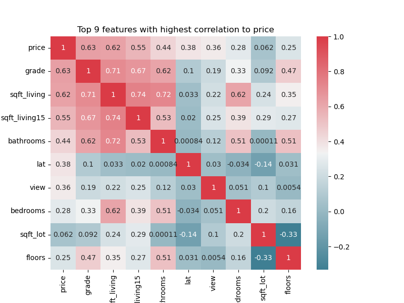
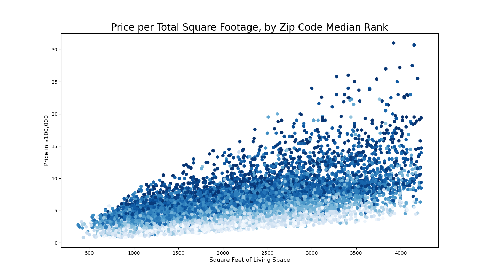
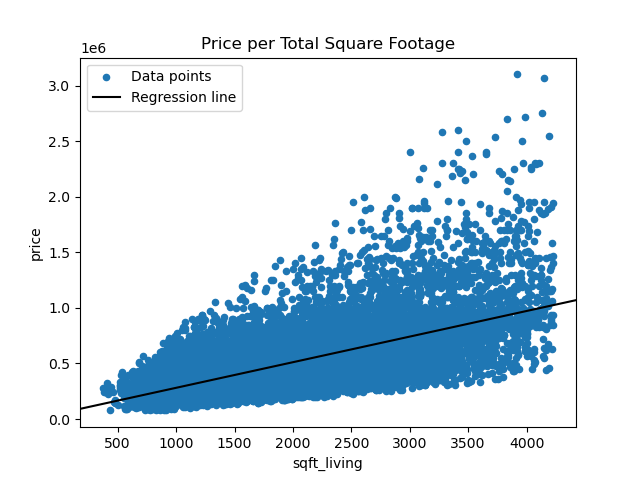

# Phase 2 project - King County House Sales Analysis
## Overview
In this project, we've been tasked to build a model that accurately predicts house prices in King Country. We start off with the given House sales dataset, clean it and lastly build a model to predict house prices using linear regression.

## Business Understanding
### Problem statement

A real estate company wishes to use the King County House Sales dataset to optimise the sale prices of the properties based on factors that are strongly associated with driving house prices.

The company wants to:

* Identify the variables affecting house prices

* Create a linear model that quantitatively relates house prices with variables

* Know the accuracy of the model, i.e. how well these variables can predict house prices

### Project objectives
1. Perform exhaustive and accurate data cleaning
2. Explore different categorical handling methods
3. Build a model that accurately predicts house prices in King County
### Real estate industry overview

The real estate market in the USA has experienced fluctuations over the years. Generally, house prices have shown an upward trend, with periods of growth followed by occasional declines. Various macro and micro factors have been driving house prices: 

* Supply and demand
* Economic conditions
* Interest rates
* Demographic changes
* Location-specific factors

Understanding these factors and their influence on prices is essential for building accurate regression models that predict housing prices effectively.

### Data understanding
This dataset contains house sale prices for King County in the USA. It includes homes sold between May 2014 and May 2015. 

During exploratory data analysis, we will carry out data cleaning and understand the relationship between dependent and independent variables, enabling us to choose the best variables for modelling.

## Modeling
### 1. Top features with strongest correlation to price
The heatmap shows the top features and the degree of correlation to price - hence most of of these were used in modelling.

### 2. Relationship between price, sqft_living and zip code.
While the raw zipcode feature showed limited correlation to price, when grouped by median price and ranked, they show a strong correlation with price. While the zipcode feature was utilized in modelling due to limited time, its important to note that its a key feature that should be further engineered and utilized in future. 

### 3. Simple linear regression
The first model was price against sqft_living. The model was statistically significant overall, with an F-statistic p-value well below 0.05 The model explains about 38% of the variance in price. This was an indicator that we need more features to be able to explain price variance at a higher percentage. 
 

 ### 4. Multiple linear regression
 Our third model took in 5 top continious features i.e. "sqft_living", "bathrooms", "sqft_above", "sqft_living15", 'bedrooms'
 This improved the previous models marginally and could only explain price variance by ~ 42%.
 This result underscored the importance of the ordinal encoded features such as grade and view.
 
 Our last model included all the top 9 features. This model was able to explain houses price variance by ~62%.

## Regression Results
As indicated above, our final model achieved R-squared of 62.39%. The best fit line from our final model is as below:

### *y = 498764.3 + (103300.58 X sqft_living) - (11052.18 X bathrooms) + (22215.05 X sqft_living15) - (10988.05 X bedrooms) + (89082.83 X lat) - (11809.75 X floors) - (16728.09 X sqft_lot) + (56165.34 X view) + (83155.89 X grade)*

## Conclusion and recommendations
1. The final model can explain 62.39% of the variance in house prices. 
2. The top features that influence house prices inorder of priority include: grade, sqft_living, sqft_living15, bathrooms, lat, view, bedrooms, sqft_lot and floors.
3. To improve model performance, we might recommend utilizing more features e.g., zipcode as indicated earlier. We also recommend exploring the use of polynomial features.

